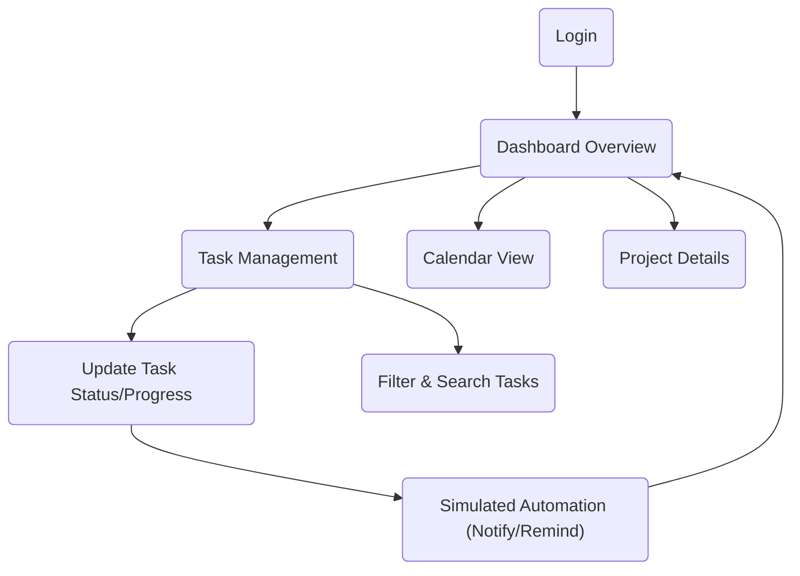

## 1. Product Overview
A clean and professional Task Management App for a Marketing Agency.
- Helps teams (Sales, Design, Content, Video, Tech, Ops) manage daily tasks and project progress.
- Allows everyone to clearly see assigned tasks, responsible persons, due dates, priorities, and current status.

## 2. Core Features

### 2.1 User Roles
| Role | Registration Method | Core Permissions |
|------|---------------------|------------------|
| Admin | Pre-assigned / Invite | Can view all, edit all, assign all |
| Staff | Pre-assigned / Invite | View all tasks, edit own tasks, update progress |

### 2.2 Feature Module
1. **Dashboard Page**: Summary cards, task charts.
2. **Task Management Page**: Detailed task table with comprehensive columns.
3. **Team Calendar View**: Calendar showing tasks, due dates, and timelines.
4. **Project Page**: Client project details and progress overview.
5. **Filter & Search**: Advanced filtering by team, assignee, client, date, status, priority.
6. **Extra Features**: File uploads, design revision counts, client approval status, monthly reports, recurring tasks.

### 2.3 Page Details
| Page Name | Module Name | Feature description |
|-----------|-------------|---------------------|
| Dashboard | Summary Cards | Shows total active, pending, completed, overdue, today's, and this week's tasks. |
| Dashboard | Charts | Tasks by Team, Tasks by Status, Monthly Completed Tasks. |
| Task List | Data Table | Task ID, Client, Project, Service, Title, Desc, Dept, Assignee, Dates, Priority, Status, %, Links, Notes. |
| Calendar | Timeline | Monthly/Weekly view of tasks by due date and owner. |
| Project | Details | Client info, services subscribed, total/completed/pending tasks, team members, deadlines. |

## 3. Core Process
The user logs in and views the Dashboard for a high-level overview. They navigate to the Task Management Page to view or update their assigned tasks. Admins can create new tasks, assign them, and set due dates. The system simulates automated notifications for new assignments, approaching deadlines, and completions. Users can also check the Calendar for upcoming deadlines and the Project Page for client-specific progress.

## 4. User Interface Design
### 4.1 Design Style
- Primary colors: Clean, modern agency palette (e.g., deep blue/indigo with vibrant accents).
- Button style: Rounded, flat with subtle hover states.
- Font and sizes: Inter or a modern geometric sans-serif (e.g., Plus Jakarta Sans), highly legible.
- Layout style: Sidebar navigation with a spacious, card-based main content area.
- Icon style: Minimalist outline icons (e.g., Lucide).
- Status Labels: Color-coded pills (e.g., Red for Urgent/Overdue, Yellow for Pending, Green for Completed).

### 4.2 Page Design Overview
| Page Name | Module Name | UI Elements |
|-----------|-------------|-------------|
| Dashboard | Stats | Grid layout, large numbers, subtle icons. |
| Task List | Table | Sticky header, pagination, inline status dropdowns, search bar. |
| Calendar | Grid | Standard calendar grid, color-coded task blocks by department. |

### 4.3 Responsiveness
Desktop-first approach, optimized for large data tables, with responsive stacking for mobile views (cards instead of tables on mobile).
