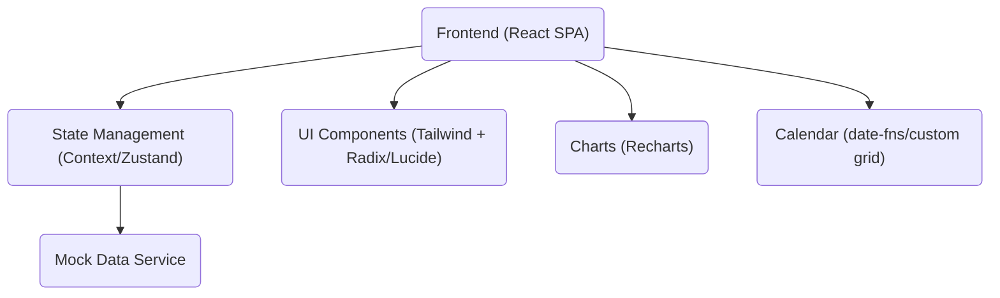
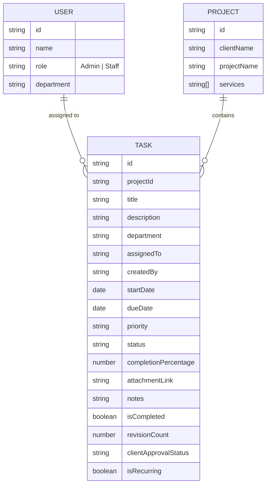

## 1. Architecture Design

## 2. Technology Description
- Frontend: React@18 + TailwindCSS@3 + Vite
- Icons: lucide-react
- Charts: recharts
- State Management: React Context + useReducer
- Date Formatting: date-fns
- Routing: react-router-dom

## 3. Route Definitions
| Route | Purpose |
|-------|---------|
| / | Dashboard Overview |
| /tasks | Task Management Data Table |
| /calendar | Team Calendar View |
| /projects | Project List & Details |
| /reports | Monthly Performance Report |

## 4. Data Model (Mock)
### 4.1 Data Model Definition

